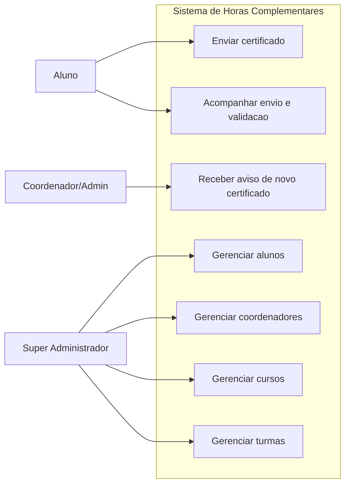
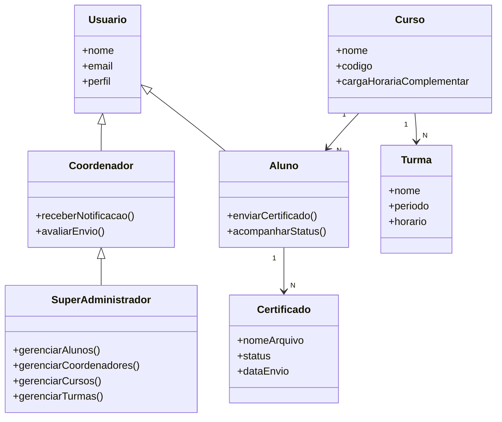
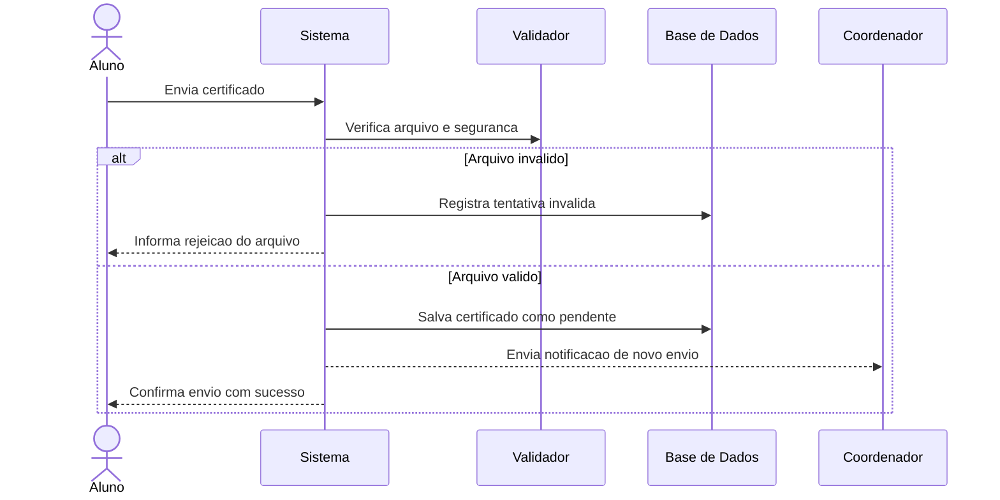

# Modelagem UML - Versao para Apresentacao ao Cliente

Este material mostra como o sistema funciona de forma simples, destacando:
- Quem usa o sistema
- O que cada perfil pode fazer
- Como as partes principais se relacionam
- Como acontece um fluxo importante na pratica

## 1) Casos de Uso (visao de negocio)

Leitura rapida:
- O aluno envia documentos e acompanha o andamento.
- O coordenador recebe alertas para analisar os envios.
- O super administrador organiza a estrutura academica (alunos, cursos, turmas e coordenadores).

## 2) Diagrama de Classes (estrutura principal)

Leitura rapida:
- Usuario e a base dos perfis do sistema.
- Aluno e Coordenador sao especializacoes com responsabilidades diferentes.
- Curso organiza turmas e alunos.
- Certificado representa os documentos enviados pelo aluno.

## 3) Diagrama de Sequencia (exemplo principal)

Cenario: envio e validacao de certificado.

Leitura rapida:
- O aluno envia o documento.
- O sistema valida automaticamente.
- Se estiver correto, o envio segue para analise e o coordenador e avisado.

## Mensagem para apresentar ao cliente

- O sistema organiza todo o ciclo de horas complementares, do envio do documento ate a analise.
- O processo reduz trabalho manual com validacoes automaticas e notificacoes.
- A estrutura de perfis garante controle e seguranca das operacoes.
