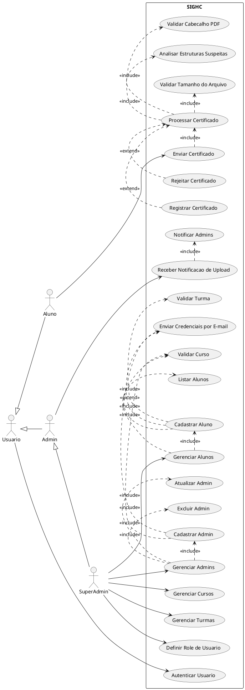
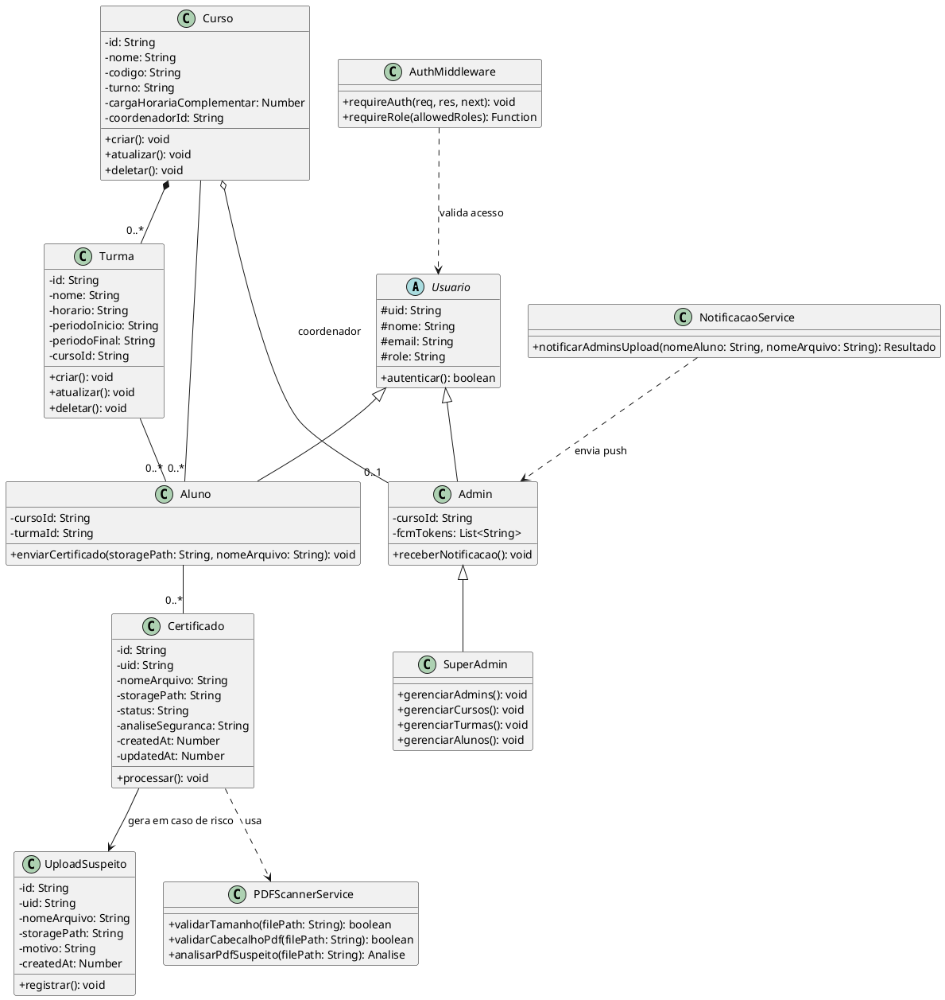
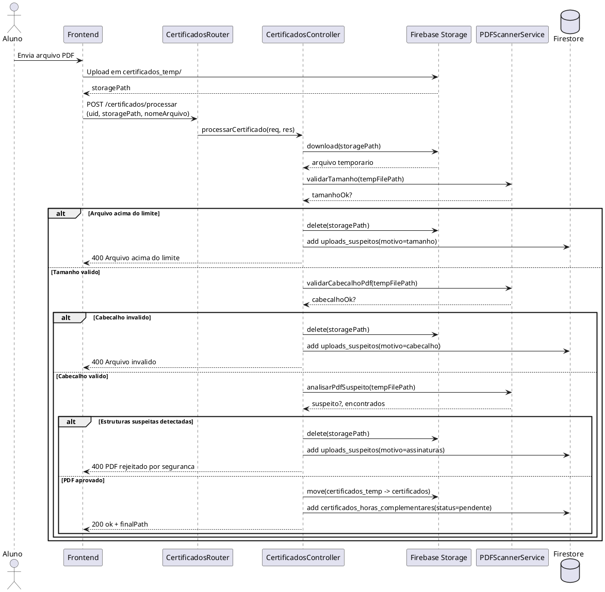

# Modelagem UML - SIGHC (backend/functions)

Este documento consolida 3 diagramas UML do projeto:
1. Casos de Uso
2. Classes
3. Sequencia (cenario: processamento de certificado)

## 1) Diagrama de Casos de Uso

## 2) Diagrama de Classes

## 3) Diagrama de Sequencia

Cenario escolhido: processamento de certificado (endpoint `POST /certificados/processar`).

## Observacoes rapidas

- Os casos de uso foram derivados das rotas e controllers atuais.
- O diagrama de classes combina classes de dominio (Usuario, Curso, Turma, Certificado) com classes de servico/infraestrutura usadas no backend.
- O diagrama de sequencia segue exatamente o fluxo principal de `processarCertificado`.
